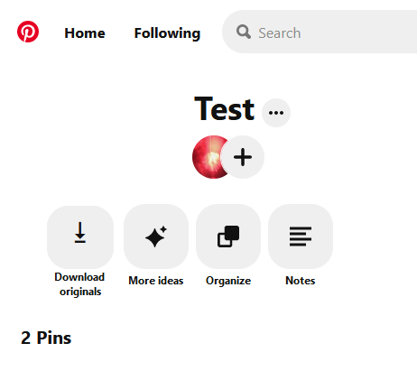

# pinterest-Backup-Original-Files

[**Click here for install**](https://github.com/cvzi/pinterest-Backup-Original-Files/raw/master/Pinterest.com_Backup_Original_Files.user.js)

This is a [Greasemonkey](https://addons.mozilla.org/en-US/firefox/addon/greasemonkey/) script.
You can find information about Greasemonkey scripts over at [wiki.greasespot.net](https://wiki.greasespot.net/Greasemonkey_Manual:Installing_Scripts).

The scripts lets you download all original images from your Pinterest.com profile. 

It adds a red download button at the top of your boards. The script also creates an entry in the Greasemonkey menu.

Simply go to one of your boards, scroll down to the last image and click the download button or option in the menu.

The images will be downloaded and packed into a single Zip file file for you.

Works with Firefox and Chrome (via [Tampermonkey](http://tampermonkey.net/))

The Zip file contains all original photos. If there were errors, the thumbnails of the missing photos will be added to a special folder "error_thumbnails" in the Zip file.
